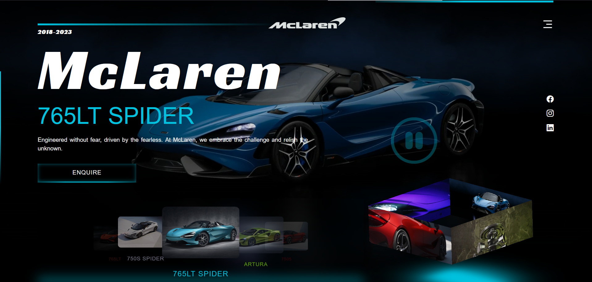

## McLaren

## Built with
    

- **Frontend**: CSS, Javascript
- **Version Control**: Git
- **Hosting**: Github Pages

## Setup and Installation
Fork and Clone this project. Make sure you have git installed. On the terminal, navigate to your workspace directory and run it
​
## Future Scope
- UI part can be improved by adding some animations
- Authentication can be added 
- Backend can be thought to get introduced
​

